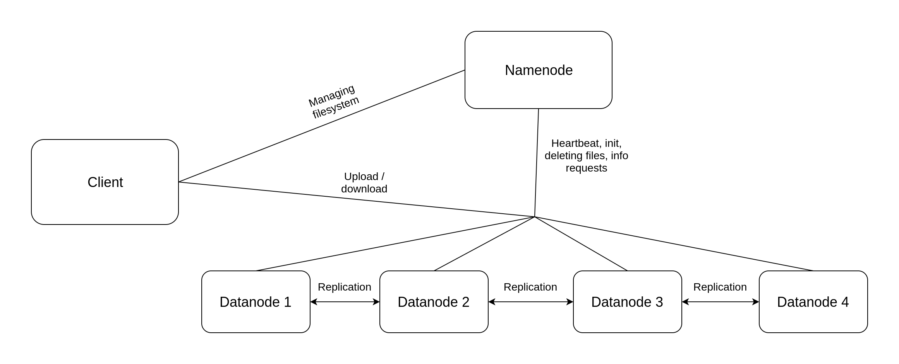

# Distributed File System client
>Client for communication with fault-tolerant file system that supports file reading, writing, copying, moving, deletion and different directory operations.

>Written by Anastasiia Gromova (telegram: @n_whovian)

## Launch the system
The system consists of three main components: naming server, storage server (in our implementation there are 4 such servers) and client application.
Naming and storage servers (namenode and datanode) are written in Python and deployed on AWS instances using docker swarm.
You can find the images here: [datanode](https://hub.docker.com/repository/docker/onbehalfofme/dfs-datanode), [namenode](https://hub.docker.com/repository/docker/onbehalfofme/dfs-namenode).
Client web-application is written in JavaScript with Vue.js framework. 
You can launch the dfs client:
``` 
# install dependencies
npm install

# serve with hot reload at localhost:8080
npm run dev

# build for production with minification
npm run build

# build for production and view the bundle analyzer report
npm run build --report

# run unit tests
npm run unit

# run all tests
npm test
```
The client interacts with already deployed namenode and datanodes.

## Architecture
As it was said before, the system consists of three components, that interact with each other:



#### Namenode -> Datanode
* GET /health - namenode checks the datanode every 30 sec
* GET /info - namenode requests a file info from datanode
* GET /delete - namenode tells datanode to delete a file
* GET /init - namenode tells datanode to initialize a storage 
* GET /rmdir - namenode tells datanode to delete a directory
* GET /move - namenode tells datanode to move file
* GET /copy - namenode tells datanode to copy file

#### Datanode -> Namenode
* GET /replicate - datanode asks a namenode where to send a replication

#### Client -> Namenode
* GET /init - initialize new storage (delete everything and return the available size)
* GET /create - create an empty file
* GET /read - get a list of datanodes that contain such file (from where to download a file)
* GET /write - get a datanode IP (where to upload a file)
* GET /delete_file - delete a file from DFS
* GET /info - get information about a file
* GET /copy - create a copy of file
* GET /move - move a file
* GET /cd - change the current directory
* GET /ls - return a list of stored files/directories
* GET /mkdir - create a new directory
* GET /delete_dir - delete a directory

#### Client -> Datanode
* GET /download - download the file from datanode
* POST /upload - send a file by chunks (of 1 Mb) to datanode
---
For a detailed explanation on how things work, check out the [guide](http://vuejs-templates.github.io/webpack/) and [docs for vue-loader](http://vuejs.github.io/vue-loader).

